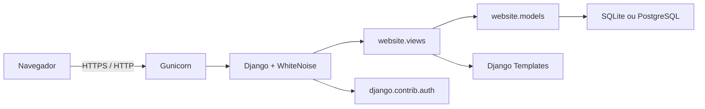
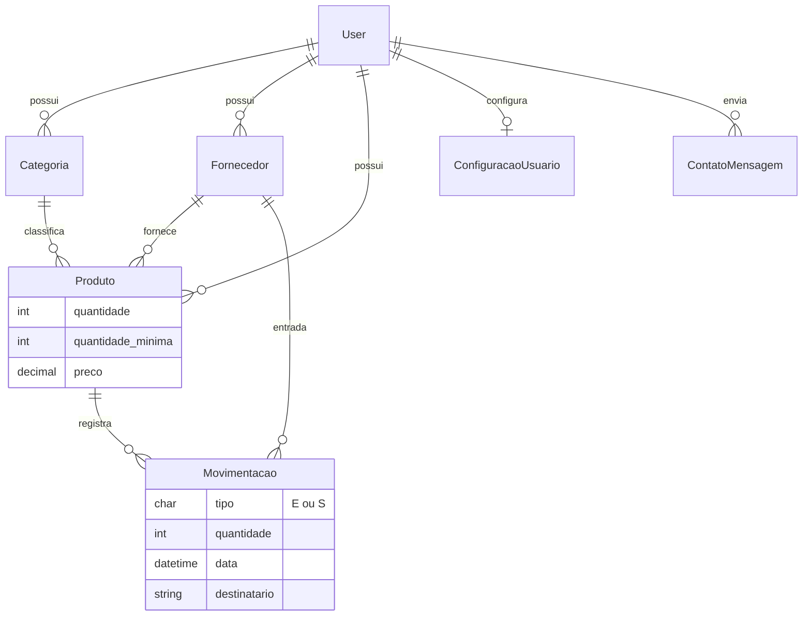
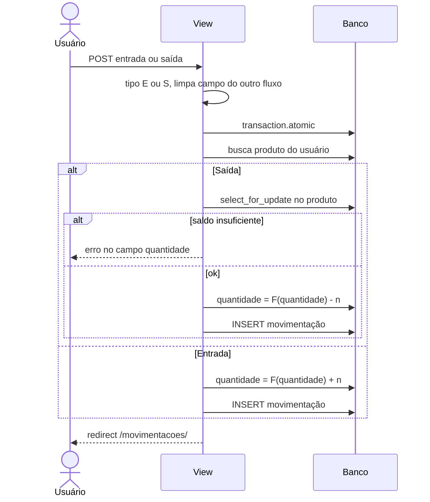
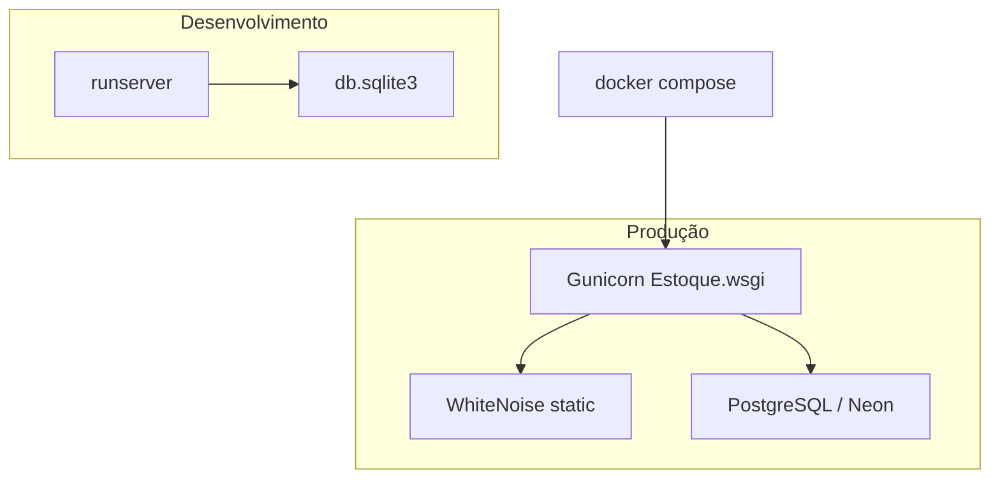

# System design — StockBot

Documento de arquitetura do StockBot: um monolito Django que isola os dados de estoque por conta de usuário.

## 1. Contexto

O StockBot serve um único operador (pequeno comércio, estoquista ou dono de loja) por conta. Não há papéis internos (admin de empresa vs. colaborador). O isolamento é **conta = tenant**: todo registro de negócio aponta para `User` ou chega nele via `produto.usuario`.

Objetivos de produto:

- Registrar produtos, categorias e fornecedores
- Entrar e sair estoque sem saldo negativo
- Mostrar status (ok / baixo / zerado) e alertas no header
- Agregar valor e movimento em painel e relatórios

Fora de escopo atual: multi-loja, permissões por time, API pública, filas e cache distribuído.

## 2. Visão da arquitetura

Aplicação web síncrona. Um processo WSGI atende HTML; o banco é a fonte da verdade.

Camadas no app `website`:

| Camada | Onde | Responsabilidade |
| --- | --- | --- |
| HTTP / rotas | `Estoque/urls.py`, `website/urls.py` | Mapeia URLs para CBVs |
| Apresentação | `website/templates/`, Crispy + Tailwind | HTML autenticado (sidebar) ou landing |
| Aplicação | `website/views.py`, `mixins.py` | Auth, escopo de dono, formulários, agregações |
| Domínio | `Produto.registrar_entrada/saida`, constraints | Regras de saldo |
| Consultas | `charts.py`, `relatorio_filtros.py`, `notifications.py` | Relatórios e alertas |
| Persistência | ORM + `dj-database-url` | SQLite local ou Postgres em produção |

O projeto Django chama-se `Estoque`; o produto na UI chama-se StockBot.

## 3. Modelo de dados

Regras no banco:

- `Produto.preco >= 0` e `Produto.quantidade >= 0` (`CheckConstraint`)
- `Movimentacao.quantidade >= 1`
- Telefone de fornecedor com validador BR
- `ConfiguracaoUsuario` é 1:1 com `User` (`get_or_create` nas configurações)

`Movimentacao` não tem FK direta para o usuário. O dono é `produto.usuario`. QuerySets:

- `OwnerQuerySet.do_usuario` em categoria, fornecedor e produto
- `MovimentacaoQuerySet.do_usuario` filtra `produto__usuario`

## 4. Isolamento por usuário

Todas as páginas internas usam `AppLoginRequiredMixin` (`LOGIN_URL = login`).

`OwnerScopedMixin`:

- Listagens e updates filtram pelo usuário logado
- Em `Movimentacao`, o filtro é `produto__usuario`
- Creates gravam `instance.usuario = request.user`

Formulários restringem FKs (`categoria`, `fornecedor`, `produto`) ao queryset do usuário. Views de entrada/saída revalidam o produto com `Produto.objects.do_usuario(...)` antes de alterar saldo.

Contas autenticadas não acessam cadastro/login (`RedirectIfAuthenticatedMixin` → painel).

## 5. Fluxo de movimentação

Entrada e saída passam por views distintas (`CreateMovimentacaoEntradaView` / `CreateMovimentacaoSaidaView`). O hub `/movimentacao/` só escolhe o tipo.

Detalhes:

- Atualização de saldo usa `F()` para evitar read-modify-write sem lock
- Saída usa `select_for_update` para duas requisições concorrentes no mesmo produto
- Se o produto não for do usuário, o form volta inválido
- Entrada zera `destinatario`; saída zera `fornecedor`

A quantidade em `Produto` é o saldo atual. `Movimentacao` é o histórico; não há recálculo de saldo a partir do histórico.

## 6. Status de estoque e notificações

Status derivado (não persistido):

| Condição | Status |
| --- | --- |
| `quantidade == 0` | Sem estoque |
| `0 < quantidade <= quantidade_minima` | Estoque baixo |
| demais | Estoque ok |

`quantidade_minima` padrão: 15.

`alertas_estoque_usuario` monta a lista do header (sem estoque primeiro, depois baixo). `estoque_notifications` injeta isso em todos os templates autenticados.

`ConfiguracaoUsuario` liga/desliga o conjunto e cada tipo de alerta. Painel também respeita `relatorios_resumo` para métricas automáticas.

## 7. Painel e relatórios

`DashboardContextMixin` calcula, no banco, totais do usuário: quantidade de produtos, sem estoque, estoque baixo, em estoque e valor (`Σ quantidade × preço`).

Relatórios (`FiltroRelatorio`) leem GET:

- período: 7d, 30d, 3m, 6m, ano
- categoria (só se for do usuário)
- tipo E/S

`charts.py` agrega para Chart.js: movimento diário, top produtos movimentados, valor de estoque mensal. A distribuição por categoria é valor em estoque, não volume de vendas.

## 8. Autenticação e conta

- Cadastro: e-mail como username (`CadastroUsuarioForm`), senha do `UserCreationForm`
- Login: `LoginView` + `LoginForm`
- Perfil: nome, e-mail e senha em views separadas; exclusão com senha de confirmação
- Sessão Django padrão; cookies `Secure` quando `DEBUG=False`

Não há OAuth, 2FA nem recuperação de senha por e-mail neste desenho.

## 9. Frontend

- Landing pública (`home.html`)
- Shell autenticado (`base.html`): sidebar, header, dropdown de alertas
- Formulários CRUD no template único `model_form_page.html` + `ModelFormPageMixin`
- Tailwind 4 compilado para `static/css/style.css` (fonte: `static/css/src/input.css`)
- Ionicons via CDN; Chart.js nas páginas de painel/relatórios
- `static_extras` versiona assets para cache-bust
- Idioma `pt-br`, fuso `America/Sao_Paulo`

## 10. Persistência e deploy

`dj_database_url.config` lê `DATABASE_URL`. Sem URL, usa SQLite em `db.sqlite3`. `conn_max_age=600` reusa conexões (útil no Postgres).

- `Dockerfile`: Python 3.11-slim, `collectstatic`, Gunicorn em `:8000`
- `docker-compose.yml`: volume para dados SQLite, `DEBUG=True` no compose (ajuste para produção)
- WhiteNoise serve estáticos; `STATIC_ROOT=staticfiles/`
- Com `DEBUG=False`: SSL redirect, HSTS, `X-Frame-Options: DENY`, cookies seguros, `SECURE_CONTENT_TYPE_NOSNIFF`

`SECRET_KEY` vem só do ambiente (`python-decouple`). Sem `.env` / env var, o processo não sobe.

## 11. CI

GitHub Actions (`.github/workflows/ci.yml`):

1. Python 3.11
2. `pip install -r requirements.txt`
3. `python manage.py test website` com `SECRET_KEY` de CI e `DEBUG=True`

A suíte cobre dono vs. outro usuário, movimentação, alertas e fluxos HTTP principais. Não sobe Postgres no CI: os testes usam SQLite.

## 12. Riscos e evolução

| Tema | Estado atual | Cuidado |
| --- | --- | --- |
| Tenant | Filtro em queryset/mixin | Toda view nova precisa do mixin; um `objects.get(pk=)` sem filtro vaza dado |
| Saldo | Histórico + saldo em `Produto` | Correção manual no admin ou no cadastro do produto pode divergir do histórico |
| Escala | Agregações no request | Relatórios grandes pedem índices (`usuario`, `data`) e, depois, materialização |
| Time | Um usuário = um estoque | Colaboradores exigem `Conta`/`Organizacao` e papéis |
| API | Só HTML | Se houver app mobile, extrair os serviços de domínio das views |

Caminhos naturais: unique `(usuario, nome)` em produto/categoria, índices nas FKs de dono, e extrair `registrar_entrada/saida` para um serviço testável sem HTTP.
